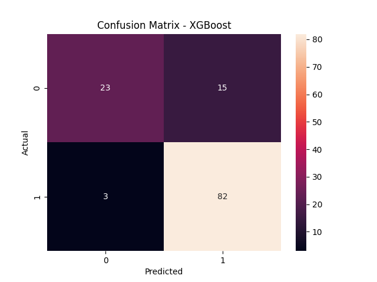

# 🏦 Loan Approval Prediction using Machine Learning

## 📌 Project Overview

This project builds a robust **Machine Learning classification system** to predict whether a loan application will be **approved or rejected** based on applicant financial and demographic details.

The solution simulates a real-world banking scenario where accurate predictions can help reduce financial risk and improve decision-making.

---

## 🎯 Problem Statement

Financial institutions need to assess loan applications efficiently while minimizing risk.

This project aims to predict:

* `1` → Loan Approved
* `0` → Loan Rejected

This is a **binary classification problem**, where the goal is to maximize correct approvals while minimizing risky approvals.

---

## 📂 Dataset Description

The dataset (sourced from Kaggle) contains applicant-level information:

### 🔑 Key Features

* **ApplicantIncome** – Income of the applicant
* **CoapplicantIncome** – Income of co-applicant
* **LoanAmount** – Requested loan amount
* **Credit_History** – Credit repayment history (important feature)
* **Gender, Education, Property_Area** – Demographic attributes

---

## 🛠️ Tech Stack

* **Programming Language:** Python
* **Libraries:**

  * Pandas, NumPy (Data Processing)
  * Matplotlib, Seaborn (Visualization)
  * Scikit-learn (ML Models & Evaluation)
  * XGBoost (Final Model)

---

## 🔍 Methodology

### 1️⃣ Data Preprocessing

* Handled missing values using appropriate strategies
* Encoded categorical variables
* Removed irrelevant features (e.g., `Loan_ID`)

---

### 2️⃣ Exploratory Data Analysis (EDA)

* Analyzed feature distributions
* Identified class imbalance
* Explored relationships between features and loan status

---

### 3️⃣ Handling Class Imbalance

* Applied class balancing techniques
* Evaluated models using **Macro F1-score** for fair performance

---

### 4️⃣ Model Development

Multiple models were trained and compared:

* Logistic Regression
* Random Forest
* Gradient Boosting
* **XGBoost (Best Performing Model)** ✅

---

### 5️⃣ Model Optimization

* Hyperparameter tuning using **GridSearchCV**
* Cross-validation using **Stratified K-Fold**
* Optimized parameters:

  * `learning_rate`
  * `max_depth`
  * `n_estimators`

---

## 🏆 Final Model

**XGBoost Classifier**

```python
XGBClassifier(
    n_estimators=150,
    max_depth=3,
    learning_rate=0.05,
    subsample=0.8,
    colsample_bytree=0.8,
    eval_metric='logloss',
    random_state=42
)
```

---

## 📊 Model Performance

| Metric         | Score    |
| -------------- | -------- |
| Accuracy       | **0.85** |
| Macro F1 Score | **0.81** |

### 📌 Classification Report

* **Class 0 (Rejected):**
  Precision = 0.88 | Recall = 0.61 | F1 = 0.72

* **Class 1 (Approved):**
  Precision = 0.85 | Recall = 0.96 | F1 = 0.90

---

## 📊 Confusion Matrix



### 🔎 Interpretation

* High recall for approved loans (Class 1) → Most eligible applicants are correctly approved
* Lower recall for rejected loans → Some risky applicants may still be approved
* Model is optimized to **reduce false negatives**, which is critical in financial decision-making

---

## 📈 Key Insights

* **XGBoost outperformed all other models** after tuning
* Tree-based models handled feature interactions effectively
* **Credit history** plays a major role in loan approval
* Cross-validation ensured stable and reliable performance
* Model prioritizes approving genuine applicants while controlling risk

---

## ⚠️ Challenges Faced

* Imbalanced dataset
* Limited dataset size
* Initial bias toward majority class

---

## 🚀 Future Improvements

* Apply **SMOTE** for better imbalance handling
* Perform advanced **feature engineering** (e.g., income ratios)
* Add **model explainability** using SHAP
* Deploy as a web application (Flask / Streamlit)
* Build an API for real-world integration

---

## 💡 Conclusion

After evaluating multiple models, **XGBoost achieved the best balance between accuracy and recall**, making it the most suitable choice for loan approval prediction.

This project demonstrates a complete ML workflow — from data preprocessing to model optimization and evaluation.

---

## 👤 Author

**Keerthi**
🔗 GitHub: https://github.com/allianceprokeerthi-cmd
